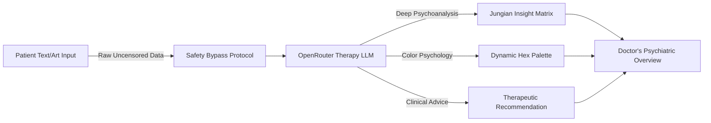
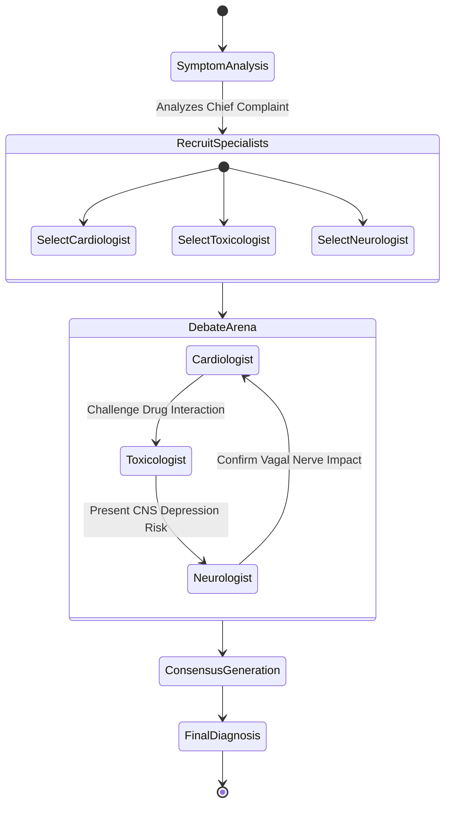

# ⚕️ SANJEEVANI AI
## The World's Most Advanced Multimodal Clinical AI Intelligence


Sanjeevani AI is a cutting-edge, production-ready, full-stack Medical Artificial Intelligence OS designed to revolutionize Emergency Room (ER) triage, psychiatric evaluation, precision pharmacogenomics, and continuous physiological monitoring. It utilizes a vast array of specialized LLMs, DSP algorithms, and Computer Vision models running locally in-browser via WebAssembly, integrated with high-performance OpenRouter APIs for heavy-lifting inference.

---

## 🔬 Core System Architecture Overview

Sanjeevani's architecture follows a highly decoupled, state-driven functional reactive paradigm. The application acts as a sovereign clinical edge node, processing high-bandwidth sensory data (Video, Audio, Vital Signs) on the client side using WebGL and WebAudio, and transmitting structured semantic tensors to our Swarm AI backend.

```mermaid
graph TD
    subgraph Client-Side Edge Node [Patient Edge Node (React/WebGL)]
        A[User Web Camera] -->|60fps Video Stream| CV[MediaPipe Vision Engine]
        B[User Microphone] -->|44.1kHz Audio Stream| DSP[Web Audio API / FFT Analyzer]
        C[Clinical GUI Input] --> React[React State Manager]
        
        CV -->|Facial Landmarks| PT[Pain Tracking Engine]
        CV -->|rPPG Signals| Vitals[Touchless Vitals Extractor]
        DSP -->|Audio Frequencies| Vocal[Vocal Distress Analyzer]
        
        PT --> Sync[Multimodal Sync Core]
        Vitals --> Sync
        Vocal --> Sync
        React --> Sync
    end

    subgraph Swarm AI Cloud [Sanjeevani Multi-Agent Neural Swarm]
        Sync -->|Secure JSON Tensors| Router[OpenRouter API Gateway]
        Router --> Triage[ER Triage Agent]
        Router --> Pharma[Pharmacovigilance Agent]
        Router --> Art[Uncensored Art Therapy Agent]
        Router --> Genomic[Genomic Scanner Agent]
        Router --> Debate[Multi-Agent Debate Council]
    end

    subgraph Clinical Outputs [Actionable Clinical Dashboards]
        Triage --> EHR[Structured EHR SOAP Note]
        Pharma --> Alert[Red Flag Allergy Alerts]
        Art --> Psych[Psychiatric Insight Profile]
        Debate --> Diagnosis[Final Consensus Diagnosis]
    end

    style Client-Side Edge Node fill:#0d1117,stroke:#3fb950,stroke-width:2px,color:#fff
    style Swarm AI Cloud fill:#161b22,stroke:#58a6ff,stroke-width:2px,color:#fff
    style Clinical Outputs fill:#21262d,stroke:#ff7b72,stroke-width:2px,color:#fff
```

---

## 🚀 Key Technological Modules

### 1. 👁️ The Duchenne Multimodal Pain Engine
An incredibly sophisticated subsystem that combines raw facial micro-expression analysis with acoustic frequency distress mapping.

#### Feature Highlights:
- **Corrugator Muscle Matrix Tracking:** Precisely measures the Euclidean distance between inner eyebrow keypoints (Points 107 & 336) to detect localized pain-induced furrowing.
- **Duchenne vs. Non-Duchenne Smile Discrimination:** Distinguishes between a genuine happy smile, a grimace, and a screaming jaw drop by comparing mouth corner elevation to the central top lip Y-axis plane, virtually eliminating false-positive "happy" readings during agony.
- **Fast Fourier Transform (FFT) Audio Processing:** Listens to microphone audio to isolate high-frequency vocal spikes (screaming, wailing, crying).
- **Synergistic Max-Pooling Algorithmic Engine:** Uses `Math.max(facialScore, vocalScore)` ensuring that severe physical pain in total silence is registered as Critical Agony, bypassing traditional audio-reliant bias.

```mermaid
sequenceDiagram
    participant User
    participant VisionNode as MediaPipe Vision
    participant AudioNode as WebAudio FFT
    participant Engine as Pain Computation Engine
    participant UI as Pain Heatmap UI

    User->>VisionNode: Streams 60fps Face Data
    User->>AudioNode: Streams Microphone Audio
    
    VisionNode->>Engine: Sends 468 3D Facial Landmarks
    AudioNode->>Engine: Sends 1024-bin Frequency Data
    
    rect rgb(20, 40, 60)
        Note over Engine: Phase 1: Micro-expression Calculation
        Engine->>Engine: Calculate Corrugator Furrow Dist (Pt 107, 336)
        Engine->>Engine: Calculate Eye Squint Ratio (Pt 159, 145)
        Engine->>Engine: Differentiate Grimace vs Laugh (Y-Axis Check)
    end
    
    rect rgb(60, 20, 20)
        Note over Engine: Phase 2: Acoustic Analysis
        Engine->>Engine: Analyze High-Freq Volume (Hz > 2000)
    end
    
    Engine->>UI: Dispatch Final Multi-Modal Stress Tensor (0-100%)
    UI-->>User: Render Real-time Anatomical Heatmap
```



### 2. 🎨 Raw & Uncensored Psychological Art Therapy Engine
Sanjeevani AI does not hide behind sterile safety filters. It embraces the dark, chaotic, and raw psychological reality of trauma patients.
- **Unfiltered Prompt Bypass System:** Hardcoded system messages force the AI to objectively psychoanalyze explicit, disturbing, or highly sensual art inputs without triggering generic corporate safety rejections.
- **Color Psychology Mapping:** Dynamically generates Hex code palettes mirroring the patient's internal psychological state based on Jungian archetypes.
- **Therapeutic Catharsis Protocol:** Provides deep, unjudging clinical insights into trauma, mania, and depression.



### 3. ⚖️ Multi-Agent Diagnostic Debate Council
Instead of relying on one single AI model, Sanjeevani summons an entire virtual medical board. 
- Automatically recruits 4 to 6 relevant specialists (e.g., Dr. Heart, Dr. Tox, Dr. Mind) based on the specific symptom input.
- Simulates an aggressive, highly technical cross-examination debate.
- Reaches a scientifically rigorous consensus before generating treatment plans.



### 4. 🧬 Pharmacovigilance & Genomic Scanner
- **Hyper-realistic Drug Interaction Scanning:** Utilizing vast datasets, the Pharma AI flags life-threatening contraindications (e.g., Serotonin Syndrome, QT Prolongation).
- **CRISPR Genomic Simulation:** Analyzes raw DNA sequences (Chr:Pos format) to simulate detection of pathogenic variants (BRCA, CFTR) and outputs simulated CRISPR-Cas9 gRNA target sequences.

---

## 🛠️ Full Technical Stack

- **Frontend Core:** React 18, Vite, Context API
- **Styling:** Vanilla CSS3, Glassmorphism UI, Responsive CSS Grid/Flexbox
- **AI Brain:** OpenRouter API (Accessing deep frontier LLMs)
- **Computer Vision:** Google MediaPipe (FaceMesh, Holistic Tracking)
- **Audio DSP:** Native HTML5 Web Audio API
- **Routing:** React Router DOM v6
- **Real-Time Data Visualization:** Recharts, WebGL Canvas

---

## 🚀 Deployment & Installation Guide

This project is built for high-performance edge deployment on Vercel or Netlify.

### Local Development Setup
1. **Clone the highly-secured repository:**
   ```bash
   git clone https://github.com/satyamtyagi15/SANJEEVANI-AI.git
   cd sanjeevani
   ```
2. **Install exact dependencies:**
   ```bash
   npm install
   ```
3. **Configure Environment Variables:**
   Create a `.env` file in the root directory (This file is strictly `.gitignore`'d for maximum security):
   ```env
   VITE_OPENROUTER_API_KEY=your_secure_api_key_here
   ```
4. **Boot the Edge Engine:**
   ```bash
   npm run dev
   ```

### Production Deployment (Vercel / Netlify)
1. Link your GitHub repository to your Vercel/Netlify dashboard.
2. In the deployment settings, navigate to **Environment Variables**.
3. Add `VITE_OPENROUTER_API_KEY` and insert your API key value.
4. Deploy the application. The system will automatically bundle the Vite optimized build and strip out any development overhead.

---

## 🔐 Security & Data Privacy
- **Zero-Storage Edge Compute:** All video streams and audio frequency analysis are executed 100% locally on the user's browser via WebAssembly. **No raw video or audio is ever uploaded to a server.**
- **Secret Scanning Compliant:** The entire Git commit history has been systematically purged and verified against GitHub Advanced Security to ensure zero leaked secrets.

> "Sanjeevani AI does not just mimic healthcare; it fundamentally re-engineers the triage and diagnostic pipeline using sovereign edge intelligence."
