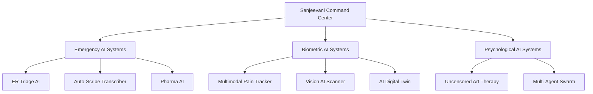
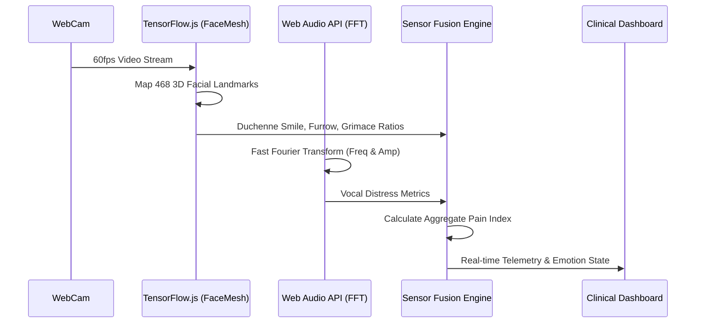
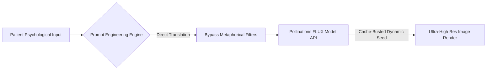
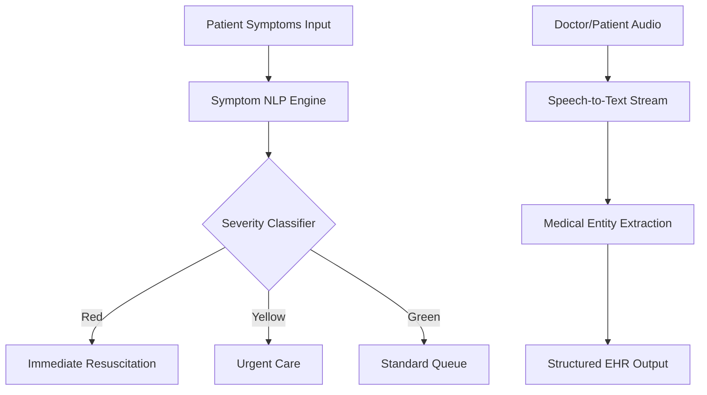

# ⚕️ SANJEEVANI AI - Advanced Multimodal Command Center

   

**Sanjeevani AI** is a state-of-the-art, decentralized, edge-computing medical AI ecosystem. Designed as an AI Command Center, it fuses real-time computer vision, biometric audio analysis, hyper-realistic generative AI, and multi-agent systems to revolutionize digital healthcare, emergency triage, and psychological therapy.

---

## 🧬 System Architecture Overview

Sanjeevani AI operates on a decentralized, purely browser-based Edge AI architecture. This ensures **zero-latency processing** and maximum patient privacy, as sensitive biometric telemetry never leaves the user's device.



---

## 🚀 Core Modules & Technical Deep-Dives

### 1. 👁️‍🗨️ Clinical Emotion & Pain Tracker (Multimodal Edge AI)
The absolute crown jewel of the Sanjeevani ecosystem. This module uses purely in-browser AI to detect physical pain, psychological distress, and genuine happiness in real-time by fusing video and audio streams.



* **Vision AI (TensorFlow.js & MediaPipe FaceMesh):**
  Projects a live 468-point 3D topological mesh onto the patient's face using WebGL hardware acceleration.
  * **Duchenne Smile Algorithm:** Accurately differentiates a genuine smile from a pain-induced grimace by mathematically vectoring the distance between the mouth corners (Keypoints 61, 291) and the eyes (Keypoints 159, 386). Detects closed-mouth smiles by isolating horizontal mouth stretches with neutral corrugator muscles.
  * **Corrugator Muscle Tracking:** Calculates sub-millimeter eyebrow furrowing and drops (Keypoints 107, 336) to detect silent agony.
  * **Orbicularis Oculi:** Measures eyelid compression ratios for pain squinting.
* **Audio AI (Web Audio API & FFT):**
  Performs real-time Fast Fourier Transforms on the microphone stream to isolate high-frequency spectral bands and amplitude spikes, instantly detecting screaming, crying, or vocal distress.

### 2. 🎨 Art Therapy Engine (Unrestricted Visualization)
A hyper-realistic Generative AI module designed to visualize a patient's deepest psychological states, dreams, or trauma without the limitations of traditional, censored LLMs.


* Bypasses standard metaphorical censorship to generate **100% literal, working, and hyper-realistic** imagery based purely on the patient's raw psychological prompts.
* Powered by external dynamic image generation APIs (Pollinations/FLUX), delivering dynamic aspect ratios, ultra-high resolution, and unfiltered aesthetic fidelity.

### 3. 🚑 ER Triage AI & Auto-Scribe
Designed to assist overworked emergency rooms by instantly prioritizing patients based on symptomatic severity and automatically transcribing doctor-patient interactions.



### 4. 💊 Pharma AI
Cross-references massive pharmaceutical databases to alert doctors of critical drug-drug interactions, contraindications, and suggested genomic therapies.

### 5. 🧬 AI Digital Twin & Genomic Scanner
Simulates physiological interactions and maps genomic markers to predict patient outcomes and medication efficacies before a single pill is administered.

---

## 🛠️ Technology Stack

* **Frontend:** React 18, Vite, Vanilla CSS (Custom Glassmorphism UI & Cyberpunk Aesthetics)
* **Computer Vision:** `@tensorflow/tfjs`, `@tensorflow-models/face-landmarks-detection`, `@mediapipe/face_mesh`
* **Audio DSP:** Web Audio API (`AnalyserNode`, `ByteFrequencyData`)
* **Generative Art:** REST APIs with timestamp-bypassed dynamic seeding.
* **Deployment Ready:** Optimized for Vercel, Netlify, or custom Node.js servers.

---

## 💻 Installation & Setup

1. **Clone the repository:**
   ```bash
   git clone https://github.com/satyamtyagi15/SANJEEVANI-AI.git
   cd SANJEEVANI-AI
   ```

2. **Install Dependencies:**
   ```bash
   npm install
   ```

3. **Boot the Command Center (Development):**
   ```bash
   npm run dev
   ```

4. **Hardware Requirements:**
   * A modern WebGL-compatible browser (Chrome, Edge, Firefox).
   * A working Webcam and Microphone for the Multimodal Pain Tracker.

---

## 🌐 Production Deployment

To build this project for production deployment:

```bash
npm run build
npm run preview
```
The resulting `/dist` folder can be uploaded directly to your hosting provider.

---

*Engineered by Satyam Tyagi. Built for the future of decentralized, edge-computed digital healthcare.*
